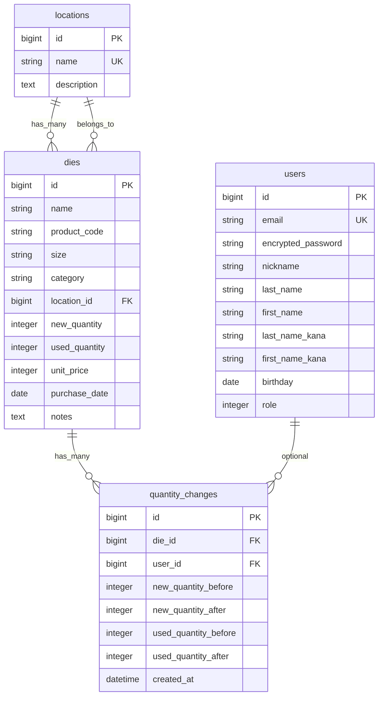
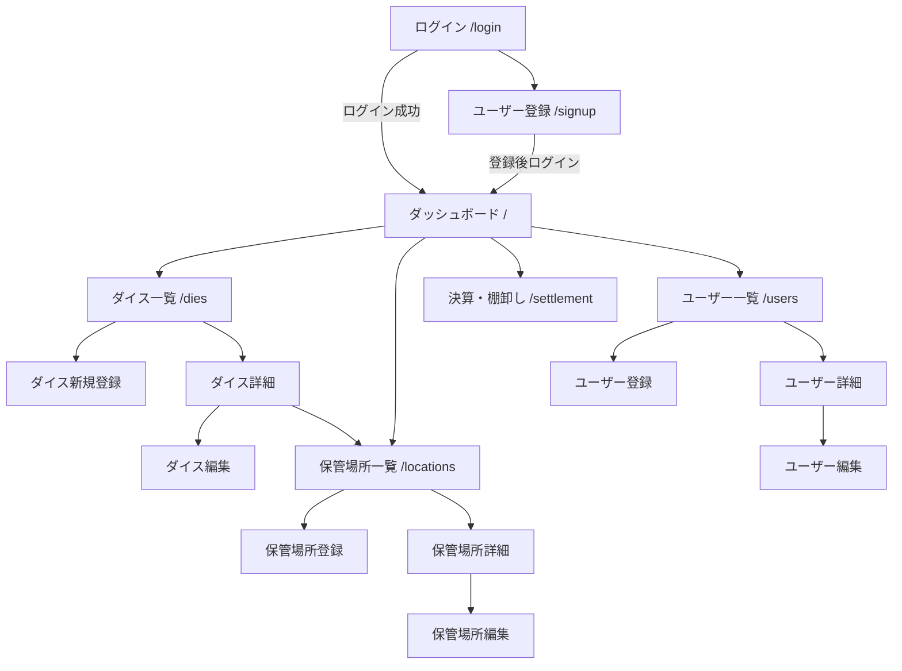

# アプリケーション名

ダイス管理システム

# アプリケーション概要

ネジ製造工場で使う**生産用ダイス（金型）**の在庫を管理する Web アプリケーションです。販売用の製品在庫ではなく、工場内の工具について「何が・どこに・何本・いくらか」を把握できます。

- ダイスの登録・検索・数量更新（新品 / 使用済み）
- 保管場所ごとの在庫確認
- 在庫少（合計 5 個以下）の可視化
- 決算時の棚卸し金額集計（新品金額と使用済み金額を別計算）
- 一般 / 管理者の権限分け

詳細仕様は [SPEC.md](./SPEC.md) を参照してください。

# URL

デプロイ完了後に記載します。

```
https://（デプロイ後のURL）
```

# テスト用アカウント

Basic 認証はありません。シード投入後、次のアカウントでログインできます。

- メールアドレス：`admin@example.com`
- パスワード：`password`
- 権限：管理者

- メールアドレス：`user@example.com`
- パスワード：`password`
- 権限：一般

公開の新規登録は `/signup` から行えます（権限は一般固定）。

# 利用方法

## ログイン・登録

1. `/login` でメールアドレスとパスワードを入力してログインする
2. アカウントがない場合は「新規登録はこちら」から必要事項を入力して登録する
3. ログイン後はダッシュボードが表示される

## 在庫の確認

1. ダッシュボードで総数量・総在庫金額・在庫少のダイスを確認する
2. 「ダイス」から名前・型番・種類・保管場所で検索する
3. 行をクリックして詳細（数量・金額・保管場所・変更履歴）を見る

## 数量の更新

1. ダイス詳細から「編集」を開く
2. 新品数量・使用済み数量を変更して保存する（確認ダイアログあり）
3. 変更内容は詳細画面の「数量変更履歴」に残る
4. 単価の変更は管理者のみ

## 決算・棚卸し

1. 「決算・棚卸し」を開く
2. 新品の在庫金額と使用済みの在庫金額を別々に確認する
3. 保管場所ごとの数量・金額内訳を見る

## マスタ管理（管理者）

1. 「保管場所」から場所の登録・編集・削除を行う（ダイスが紐づく場所は削除不可）
2. 「ユーザー」から社員アカウントの登録・編集・削除を行う
3. 最後の管理者は削除・一般への降格ができない

# アプリケーションを作成した背景

中小のネジ製造工場では、生産用ダイスが倉庫・棚・ライン手元に分散している。現場は「今、何が・どこに・何本あるか」が分からず、経理は期末に在庫金額を集計するのに時間がかかる。

表計算ソフトや紙の台帳では、新品と使用済みが混ざり、場所別の金額もすぐ出せない。このアプリは現場担当が数量を更新し、管理者が単価とマスタを守り、決算時に新品 / 使用済みを分けた在庫金額をすぐ確認できるようにするために作った。

# 洗い出した要件

要件定義は [SPEC.md](./SPEC.md) にまとめています。第1版で実装した主な要件は次のとおりです。

- ログイン必須。権限は一般と管理者
- ダイス 1 レコード = 1 種類 × 1 保管場所の現在庫
- 数量は新品と使用済みを分けて持つ
- 合計金額は DB に保存せず、`数量 × 単価` で算出する
- 棚卸し金額は新品と使用済みを別計算する
- 数量変更時のみ履歴を残す
- 数量計 5 個以下を在庫少として目立たせる

# 実装した機能についての画像やGIFおよびその説明

Gyazo / Gyazo GIF で撮影した画像 URL を、各項目の `` に貼ってください。

## ユーザー登録・ログイン

メールアドレスとパスワードでログインする。新規登録ではニックネーム、氏名（全角）、フリガナ（全角カタカナ）、生年月日、パスワード（8文字以上）を入力する。登録後はログイン状態でダッシュボードへ遷移する。


## ダッシュボード

ログイン後のトップ画面。ダイス種類数、総在庫数量（新品 / 使用済み / 計）、総在庫金額、在庫少（合計 5 個以下）の一覧を表示する。


## ダイス一覧・検索

ダイス名、型番、種類、保管場所で AND 検索できる。一覧には新品・使用済み・計・単価・合計金額を出し、在庫少の行はラベルと背景色で強調する。検索結果の件数と金額合計も表示する。


## ダイス登録・編集

ダイス名、型番、サイズ、種類、保管場所、新品数量、使用済み数量、単価（管理者のみ変更可）、購入日、備考を登録・更新する。合計金額は（新品金額 ＋ 使用済み金額）を自動計算する。数量変更時は確認ダイアログを出す。


## 数量変更履歴

数量が変わったときだけ履歴を 1 行追加する。詳細画面で日時、担当、新品・使用済みの変更前後を新しい順に確認できる。名前や単価だけの更新では履歴を作らない。


## 保管場所

場所の一覧・詳細・登録・編集。詳細ではその場所の新品・使用済み・在庫金額と、置いてあるダイス一覧を表示する。ダイスが残っている場所は削除できない。登録・編集・削除は管理者のみ。


## 決算・棚卸し

現在庫を基準に、新品金額（新品数量 × 単価）と使用済み金額（使用済み数量 × 単価）を分けて集計する。全体の在庫金額は両者の和。保管場所ごとの新品金額・使用済み金額の内訳表もある。


## 権限とユーザー管理

一般はダイスの閲覧・登録・数量更新まで。単価変更、ダイス削除、保管場所のマスタ操作、ユーザー管理は管理者のみ。管理者画面からユーザーの CRUD ができ、最後の管理者とログイン中の自分自身は削除できない。


# 実装予定の機能

[SPEC.md](./SPEC.md) の第2版ロードマップより。

- CSV 出力・インポート
- QR / バーコードによるダイス検索
- 理由付きの入出庫伝票
- 在庫不足のメール通知
- 権限の細分化（閲覧専用など）
- 期末スナップショット（基準日の在庫金額保存）
- 減価・寿命・再研磨、会計ソフト出力

# データベース設計

draw.io の原図は [original_app.dio](./original_app.dio) です。



算出項目（カラムにしない）

- 数量計 = `new_quantity + used_quantity`
- 新品金額 = `new_quantity × unit_price`
- 使用済み金額 = `used_quantity × unit_price`
- 合計金額 = 新品金額 + 使用済み金額
- 在庫少 = 数量計 ≦ 5

# 画面遷移図



未ログイン時は各画面から `/login` へリダイレクトする。ユーザー関連と保管場所の登録・編集・削除は管理者のみ。

# 開発環境

- フロントエンド：HTML / CSS（Tailwind CSS） / JavaScript（importmap, Turbo, Stimulus）
- バックエンド：Ruby 3.2.0 / Rails 7.1
- インフラ：MySQL 8（utf8mb4） / Puma
- テスト：RSpec / FactoryBot / Minitest
- テキストエディタ：Cursor
- タスク管理：GitHub / SPEC.md
- バージョン管理：Git / GitHub

# ローカルでの動作方法

以下のコマンドを順に実行する。`config/database.yml` の MySQL ユーザー・パスワード・ソケットは環境に合わせて変更する。

```
% git clone https://github.com/ユーザー名/リポジトリ名.git
% cd original_app
% bundle install
% rails db:create
% rails db:migrate
% rails db:seed
% rails tailwindcss:build
% rails server
```

ブラウザで http://localhost:3000 を開く。開発中に CSS を更新する場合は、別ターミナルで `rails tailwindcss:watch` を起動するか、`bin/dev` を使う。

# 工夫したポイント

- **現場の言葉で数量を分けた。** 新品と使用済みを別カラムにし、棚卸しでは `新品数量 × 単価` と `使用済み数量 × 単価` を別集計する。金額は DB に持たず、常に最新数量から算出する。
- **権限を業務に合わせた。** 現場（一般）は数量更新まで、単価・削除・場所マスタ・ユーザー管理は管理者のみ。最後の管理者を消せないようにし、誤操作で管理者がいなくなるのを防いだ。
- **数量変更だけ履歴に残す。** 備考や単価だけの更新では履歴を作らず、誰がいつ新品 / 使用済みを何個動かしたかが追えるようにした。
- **仕様を先に固定してから実装した。** [SPEC.md](./SPEC.md) と ER 図（`original_app.dio`）をソース・オブ・トゥルースにし、画面・計算式・権限の迷いを減らした。
- **工場向けの UI にした。** 大きな文字、表組み、在庫少の強調、コントラストの高い Tailwind の画面にした。
- **テストで計算と権限を固めた。** 金額集計・在庫少・検索・一般ユーザーが単価を変えられないことを RSpec / Minitest で確認した。

# 改善点

- **入出庫伝票がない。** いまはダイス行を直接更新している。理由付きの入庫・出庫テーブルを足し、履歴と在庫更新を一本化したい。
- **期末スナップショットがない。** 決算画面は「今開いた時点の現在庫」だけなので、基準日の在庫金額を保存するテーブルを追加したい。
- **CSV / QR がない。** 現場の棚卸し入力と現物照合を速くするため、一覧の CSV と型番の QR を足したい。
- **在庫少の通知がない。** 画面上の強調だけでなく、閾値を下回ったときに管理者へメールしたい。
- **同時更新の排他がない。** 最後の保存が勝つ。数量更新に楽観ロック（`lock_version`）を入れたい。

# 制作時間

（記入してください。例: 約80時間）
