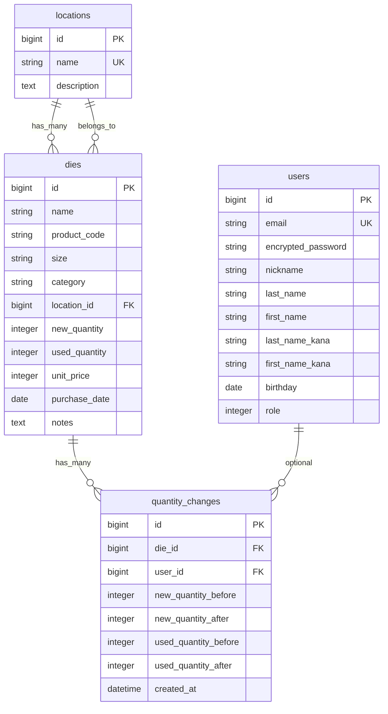
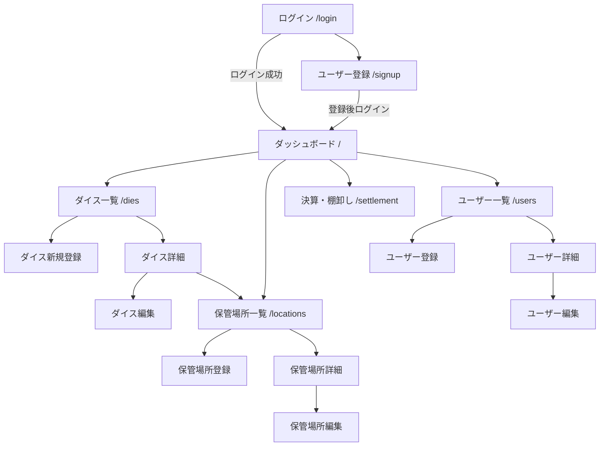

# アプリケーション名

ダイス管理システム

# アプリケーション概要

ネジ製造工場で使用する生産用ダイス（金型）の在庫を管理するWebアプリケーションです。

ダイスの登録・検索・数量管理・保管場所管理・在庫金額の確認などができます。

# URL
```
https://original-app-i8hp.onrender.com
```

# テスト用アカウント

### 管理者

```text
メールアドレス：admin@example.com
パスワード：password
```

### 一般ユーザー

```text
メールアドレス：user@example.com
パスワード：password
```

Basic認証はありません。

---

## 利用方法

### 1. ログイン

`/login` からログインします。

アカウントがない場合は、新規登録を行います。

### 2. ダイスの確認

ダッシュボードから在庫状況を確認できます。

ダイス一覧では、以下の条件から検索できます。

* ダイス名
* 型番
* 種類
* 保管場所

### 3. ダイスの登録・編集

ダイスの以下の情報を登録・編集できます。

* ダイス名
* 型番
* サイズ
* 種類
* 保管場所
* 新品数量
* 使用済み数量
* 単価
* 購入日
* 備考

### 4. 数量管理

新品・使用済みの数量を変更できます。

数量を変更すると、変更履歴が記録されます。

### 5. 決算・棚卸し

新品・使用済みの数量と在庫金額を確認できます。

---

## アプリケーションを作成した背景

ネジ製造工場では、生産用ダイスが倉庫や棚、製造ラインなど複数の場所に保管されています。

そのため、

* どこに何があるか分かりにくい
* 在庫数の確認に時間がかかる
* 棚卸し時の金額計算に手間がかかる

といった課題があります。

そこで、ダイスの数量や保管場所を一元管理し、在庫確認や棚卸しを簡単にするために作成しました。

---

# 実装した機能についての画像やGIFおよびその説明

## ユーザー登録・ログイン

メールアドレスとパスワードでログインできます。

- ユーザー登録・ログイン

[](https://gyazo.com/882cf855172ac49798889bdb5e7a3f2a)

## ダッシュボード

ログイン後のトップ画面。ダイス種類数、総在庫数量（新品 / 使用済み / 計）、総在庫金額、在庫少（合計 5 個以下）の一覧を表示する。

- ダッシュボード

[](https://gyazo.com/12a4e2279416b3960577ee88d0d5ff3a)

## ダイス一覧・検索

ダイス名、型番、種類、保管場所で AND 検索できる。一覧には新品・使用済み・計・単価・合計金額を出し、在庫少の行はラベルと背景色で強調する。検索結果の件数と金額合計も表示する。

- ダイス一覧

[](https://gyazo.com/dca68eca9231520a4e3905150e3fdf74)

## ダイス登録・編集

ダイス名、型番、サイズ、種類、保管場所、新品数量、使用済み数量、単価（管理者のみ変更可）、購入日、備考を登録・更新する。合計金額は（新品金額 ＋ 使用済み金額）を自動計算する。数量変更時は確認ダイアログを出す。

- ダイス登録
  
[](https://gyazo.com/d6fdd23cd9c10b54aebf8af72f204c8f)

- ダイス編集
  
[](https://gyazo.com/fbe4313c65930f167a574292253635c1)

## 数量変更履歴

数量が変わったときだけ履歴を 1 行追加する。詳細画面で日時、担当、新品・使用済みの変更前後を新しい順に確認できる。名前や単価だけの更新では履歴を作らない。

- 数量変更履歴
  
[](https://gyazo.com/f83a744eeb7a95313a721951f1907373)

## 保管場所

ダイスの保管場所を登録・編集できます。

- 保管場所登録
  
[](https://gyazo.com/6f62f0e66a0f86521446a496c65dac0b)

- 保管場所編集

[](https://gyazo.com/08880834ee845f5915a1e4f4b91aec85)

## 決算・棚卸し

現在庫を基準に、新品金額（新品数量 × 単価）と使用済み金額（使用済み数量 × 単価）を分けて集計する。全体の在庫金額は両者の和。保管場所ごとの新品金額・使用済み金額の内訳表もある。

[](https://gyazo.com/50c03642f7463c36608a771b79e6be8d)

## ユーザー管理

管理者はユーザーの登録・編集・削除ができます。

- ユーザー登録
  
[](https://gyazo.com/d671e9dd957a717654c9bce6bd09b09b)

- ユーザー削除
- 
[](https://gyazo.com/46e2ddd2862b3734ebb9cb0c0aa89398)

- ユーザー編集

[](https://gyazo.com/e1879492284d786d8cf98311dad59032)

## 管理者によるダイス削除・ユーザー管理

一般ユーザーと管理者で操作できる機能を分け、ダイスの削除や単価の変更、保管場所・ユーザーの管理は管理者のみが行えるます。

- 管理者としてダイスの削除

[](https://gyazo.com/09ba5f014c697bb9c2f7db2b0b3ae58d)

- 一般ユーザーの場合、削除ボタンは表示されない

[](https://gyazo.com/ce64ee74193102c237d9c14fd1405467)


- 管理者として保管場所の削除

[](https://gyazo.com/6241dc37d1a61cf2b1dec6803f48ad3b)

- 一般ユーザーの場合、保管場所の削除ボタンは表示されない

[](https://gyazo.com/85a15af395ee64c63a7b153fe44183c1)


# 実装予定の機能

* CSV出力・インポート
* QRコード・バーコードによるダイス検索
* 入出庫履歴の管理
* 在庫不足時のメール通知
* 期末時点の在庫金額保存

---

# データベース設計


```mermaid
erDiagram
  users {
    bigint id PK
    string email UK
    string encrypted_password
    string nickname
    string last_name
    string first_name
    string last_name_kana
    string first_name_kana
    date birthday
    integer role
  }

  locations {
    bigint id PK
    string name UK
    text description
  }

  dies {
    bigint id PK
    string name
    string product_code
    string size
    string category
    bigint location_id FK
    integer new_quantity
    integer used_quantity
    integer unit_price
    date purchase_date
    text notes
  }

  quantity_changes {
    bigint id PK
    bigint die_id FK
    bigint user_id FK
    integer new_quantity_before
    integer new_quantity_after
    integer used_quantity_before
    integer used_quantity_after
    datetime created_at
  }

  locations ||--o{ dies : "has_many"
  dies }o--|| locations : "belongs_to"
  dies ||--o{ quantity_changes : "has_many"
  users ||--o{ quantity_changes : "optional"
```

算出項目（カラムにしない）

- 数量計 = `new_quantity + used_quantity`
- 新品金額 = `new_quantity × unit_price`
- 使用済み金額 = `used_quantity × unit_price`
- 合計金額 = 新品金額 + 使用済み金額
- 在庫少 = 数量計 ≦ 5

# 画面遷移図


```mermaid
flowchart TD
  login["ログイン /login"]
  signup["ユーザー登録 /signup"]
  dash["ダッシュボード /"]
  dies["ダイス一覧 /dies"]
  dieNew["ダイス新規登録"]
  dieShow["ダイス詳細"]
  dieEdit["ダイス編集"]
  locs["保管場所一覧 /locations"]
  locNew["保管場所登録"]
  locShow["保管場所詳細"]
  locEdit["保管場所編集"]
  settle["決算・棚卸し /settlement"]
  users["ユーザー一覧 /users"]
  userNew["ユーザー登録"]
  userShow["ユーザー詳細"]
  userEdit["ユーザー編集"]

  login -->|ログイン成功| dash
  login --> signup
  signup -->|登録後ログイン| dash
  dash --> dies
  dash --> locs
  dash --> settle
  dash --> users
  dies --> dieNew
  dies --> dieShow
  dieShow --> dieEdit
  dieShow --> locs
  locs --> locNew
  locs --> locShow
  locShow --> locEdit
  users --> userNew
  users --> userShow
  userShow --> userEdit
```

未ログイン時は各画面から `/login` へリダイレクトする。ユーザー関連と保管場所の登録・編集・削除は管理者のみ。

# 開発環境

| 分類      | 使用技術                                   |
| ------- | -------------------------------------- |
| フロントエンド | HTML / CSS / JavaScript / Tailwind CSS |
| バックエンド  | Ruby 3.2.0 / Ruby on Rails 7.1         |
| データベース  | MySQL / PostgreSQL                     |
| テスト     | RSpec / Minitest                       |
| インフラ    | Render                                 |
| バージョン管理 | Git / GitHub                           |

---

# ローカルでの動作方法

```bash
git clone https://github.com/khunsaww/original_app.git
cd original_app

bundle install
rails db:create
rails db:migrate
rails db:seed
rails tailwindcss:build
rails server
```

ブラウザで以下にアクセスします。

```text
http://localhost:3000
```

# ## 工夫したポイント

### 新品・使用済みを分けて管理

新品と使用済みの数量を分けて管理し、それぞれの在庫金額を自動計算できるようにしました。

### 数量変更履歴

数量が変更された場合、誰が・いつ・どのように変更したかを記録するようにしました。

### 権限管理

一般ユーザーと管理者で操作できる機能を分けました。

### 現場を意識した画面設計

在庫数や在庫金額を確認しやすいように、表形式で表示し、在庫が少ないダイスを分かりやすく表示しました。

---

## 改善点

* 入出庫の理由を記録できるようにする
* 期末時点の在庫金額を保存できるようにする
* CSV出力やQRコードに対応する
* 在庫が少なくなった場合にメール通知する
* 同時更新によるデータの競合を防ぐ

---

# 制作時間

* 約45時間
