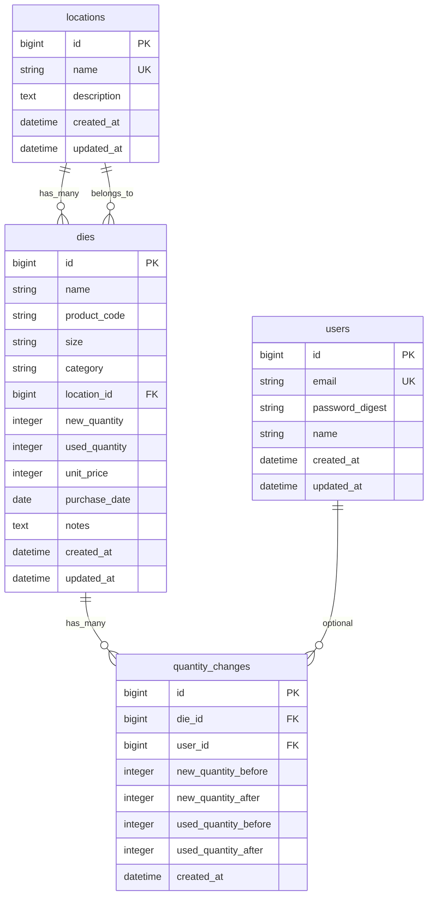

# ネジ製造用ダイス管理システム 仕様書（第1版）

本書は、ネジ製造工場で使う**生産用ダイス**の種類・保管場所・数量・価値を管理し、決算時の棚卸しと在庫金額集計を簡単にするための Web アプリケーション仕様である。

対象は販売用の製品在庫ではなく、工場内で使う生産用工具（ダイス）である。

---

## 1. 目的と対象外

### 1.1 目的

- ダイスの在庫状況を簡単に確認する
- ダイスの保管場所をすぐに確認する
- ダイスの数量を管理する
- ダイスの価値（金額）を管理する
- 決算時に在庫金額・資産価値を簡単に集計する

現場が「何が・どこに・何本・いくら」を把握し、経理が期末の在庫総額をすぐ出せるようにする。

### 1.2 対象外（第1版）

- 会計ソフト連携・仕訳出力
- 減価償却
- 入出庫伝票・移動伝票（数量はダイスレコードの直接更新）
- 生産計画・工程管理
- 販売管理
- CSV 入出力、QR / バーコード、在庫不足の自動通知、細かい権限ロール（閲覧専用など。 [9. 第2版以降](#9-第2版以降ロードマップ) ）

---

## 2. 技術スタック

第1版で採用する。

| 層 | 技術 |
| --- | --- |
| 言語 | Ruby |
| フレームワーク | Ruby on Rails |
| DB | MySQL |
| フロント | HTML / CSS / JavaScript |
| UI | 日本語。工場の社員が使いやすい、シンプルな画面 |

ブラウザから利用する。想定は中小工場の単一拠点（社内 LAN または VPN）。

---

## 3. 利用者と画面の想定

| 利用者 | 主な作業 |
| --- | --- |
| 現場（一般） | ダイスの確認、保管場所の参照、数量の更新 |
| 管理者（admin） | 単価、保管場所マスタ、ユーザー管理、削除 |

ログイン必須。権限は **一般** と **管理者** の 2 種。パスワードリセットや SSO は必須としない。

---

## 4. 業務モデルと DB 設計

第1版は「品目マスタ」と「場所ごとの在庫行」を分けない。**ダイス 1 レコード = 1 種類の現在庫**（保管場所 1 箇所・数量・単価をその行が持つ）。同じ型番を複数場所に置く場合は、場所ごとにダイス行を分ける。

合計金額は DB に保存しない。棚卸しの金額は**新品**と**使用済み**を別々に算出する（それぞれ `数量 × unit_price`）。合計金額は両者の和。数量も新品と使用済みを分けて持つ。

### 4.1 ER 図

- `Location has_many :dies`
- `Die belongs_to :location`
- `Die has_many :quantity_changes`
- `User has_many :quantity_changes`（ユーザー削除時は履歴の user_id を NULL）

### 4.2 テーブル定義

#### locations（保管場所）

工場 A、第1倉庫、棚 A-01 など、フラットな一覧で登録する（階層は名称で表現してよい）。

| カラム | 型（想定） | 制約 | 説明 |
| --- | --- | --- | --- |
| id | bigint | PK | 保管場所 ID |
| name | varchar | NOT NULL, UNIQUE | 表示名（例: 第1倉庫、棚A-01） |
| description | text | 任意 | 補足 |
| created_at | datetime | NOT NULL | |
| updated_at | datetime | NOT NULL | |

#### dies（ダイス）

画面上の「ダイスID」は本テーブルの `id`（自動採番）とする。

| カラム | 型（想定） | 制約 | 説明 |
| --- | --- | --- | --- |
| id | bigint | PK | ダイスID |
| name | varchar | NOT NULL | ダイス名 |
| product_code | varchar | NOT NULL | 型番 |
| size | varchar | 任意 | サイズ（呼び径・ピッチ等） |
| category | varchar | 任意 | 種類（ヘッダーダイス、転造ダイス、トリムダイス等） |
| location_id | bigint | NOT NULL, FK → locations.id | 保管場所 |
| new_quantity | integer | NOT NULL, 0 以上 | 新品の数量 |
| used_quantity | integer | NOT NULL, 0 以上 | 使用済みの数量 |
| unit_price | integer | NOT NULL, 0 以上 | 単価（円、小数なし） |
| purchase_date | date | 任意 | 購入日 |
| notes | text | 任意 | 備考 |
| created_at | datetime | NOT NULL | |
| updated_at | datetime | NOT NULL | |

インデックス（検索用）: `name`, `product_code`, `category`, `location_id`。

参照整合性: 保管場所の削除は、紐づくダイスがある場合は不可（restrict）。ダイスの削除は第1版では物理削除可（数量変更履歴も一緒に削除）。

#### quantity_changes（数量変更履歴）

新品・使用済みの数量が変わったときだけ 1 行追加する（名前や単価だけの更新では作らない）。履歴自体は編集しない。

| カラム | 型（想定） | 制約 | 説明 |
| --- | --- | --- | --- |
| id | bigint | PK | |
| die_id | bigint | NOT NULL, FK → dies.id | 対象ダイス |
| user_id | bigint | 任意, FK → users.id | 変更したユーザー |
| new_quantity_before | integer | NOT NULL | 変更前の新品 |
| new_quantity_after | integer | NOT NULL | 変更後の新品 |
| used_quantity_before | integer | NOT NULL | 変更前の使用済み |
| used_quantity_after | integer | NOT NULL | 変更後の使用済み |
| created_at | datetime | NOT NULL | 変更日時 |

#### users（ログイン）

| カラム | 型（想定） | 制約 | 説明 |
| --- | --- | --- | --- |
| id | bigint | PK | |
| email | varchar | NOT NULL, UNIQUE | ログイン ID |
| encrypted_password | varchar | NOT NULL | パスワード（`has_secure_password`。アプリ上は `password_digest` として扱う） |
| nickname | varchar | NOT NULL | ニックネーム |
| last_name | varchar | NOT NULL | 姓（全角） |
| first_name | varchar | NOT NULL | 名（全角） |
| last_name_kana | varchar | NOT NULL | 姓カナ（全角カタカナ） |
| first_name_kana | varchar | NOT NULL | 名カナ（全角カタカナ） |
| birthday | date | NOT NULL | 生年月日 |
| role | integer | NOT NULL, default 0 | `0=一般`, `1=管理者`（登録画面では一般固定） |
| created_at | datetime | NOT NULL | |
| updated_at | datetime | NOT NULL | |

### 4.3 算出項目（非永続）

| 項目 | 計算 |
| --- | --- |
| 数量計（1 ダイス） | `new_quantity + used_quantity` |
| 新品金額（1 ダイス） | `new_quantity * unit_price` |
| 使用済み金額（1 ダイス） | `used_quantity * unit_price` |
| 合計金額（1 ダイス） | 新品金額 ＋ 使用済み金額 |
| 総数量 | 全ダイスの数量計の和（新品合計・使用済み合計も出す） |
| 総在庫金額（総資産価値） | 新品の在庫金額 ＋ 使用済みの在庫金額 |
| 新品の在庫金額 | 全ダイスの `new_quantity * unit_price` の和 |
| 使用済みの在庫金額 | 全ダイスの `used_quantity * unit_price` の和 |
| 総種類数 | ダイス行数（`dies` の件数） |
| 保管場所別数量・在庫金額 | `location_id` でグループ化した新品・新品金額・使用済み・使用済み金額・計・在庫金額 |
| 在庫少 | 数量計 `<= 5` |

金額は円、整数のみ。丸め処理は不要。

### 4.4 なぜこの形か

- 要件の画面（一覧・詳細・決算・場所検索）は「ダイス行が場所を持つ」モデルと一致する
- 場所別集計は `dies.location_id` の GROUP BY で足りる
- 入出庫履歴・同一品目の複数場所在庫を 1 カタログにまとめる正規化は、第2版で `stock_movements` 等を足せる（ `dies` を壊さなくてよい）

---

## 5. 機能（第1版）

### 5.1 ダイス CRUD

登録・編集・削除・一覧・詳細。数量（新品／使用済み）を更新すると `quantity_changes` に履歴が残る。詳細画面で新しい順に確認できる。

- ダイスID（自動採番、編集不可）
- ダイス名、型番、サイズ、種類
- 保管場所（locations から選択）
- 新品数量、使用済み数量、単価
- 合計金額（新品金額＋使用済み金額。自動計算、入力しない）
- 購入日、備考

### 5.2 在庫一覧

表示: ダイスID、ダイス名、型番、保管場所、新品、使用済み、計、単価、合計金額。

数量計 `<= 5` の行は「在庫少」を目立たせる（ラベル＋行の強調）。

### 5.3 保管場所

- 一覧（名称・説明・ダイス件数）・登録・編集（削除は紐づくダイスが無いときのみ）
- ダイス詳細で現在の保管場所をすぐ確認できる
- 保管場所詳細で新品・使用済み・数量合計・在庫金額（合計）と、この場所のダイス一覧を表示する
- ダイス一覧の検索でも保管場所から絞り込める

### 5.4 検索

ダイス一覧で次を AND 条件で絞り込む。

- ダイス名（部分一致）
- 型番（部分一致）
- 種類（部分一致または一致）
- 保管場所（選択）

結果に、該当ダイスの新品・使用済み・計・合計金額を表示する。画面上部に検索結果の件数・新品合計・使用済み合計・金額合計も出す。

### 5.5 ダッシュボード（ログイン後トップ）

- ダイスの総種類数
- 総在庫数量（新品 / 使用済み / 計）
- 総在庫金額
- 在庫が少ないダイス（数量計 5 以下の一覧。名前・保管場所と新品・使用済み・残数）

### 5.6 決算・棚卸し画面

基準は **現在庫（画面表示時点の最新）**。過去日指定のスナップショットは第2版。

画面上部に**新品の在庫金額**と**使用済みの在庫金額**を分けて表示し、その和を**全体の在庫金額**として大きく出す。

あわせて:

- ダイスの総種類数
- ダイスの総数量（新品 / 使用済み / 計）
- 新品の在庫金額（各ダイスの `新品数量 × 単価` の和）
- 使用済みの在庫金額（各ダイスの `使用済み数量 × 単価` の和）
- 在庫の総額（総資産価値 ＝ 新品金額 ＋ 使用済み金額）
- 保管場所ごとの新品・新品金額・使用済み・使用済み金額・計・在庫金額（表）

例:

| 保管場所 | 新品 | 新品金額 | 使用済み | 使用済み金額 | 計 | 在庫金額 |
| --- | ---: | ---: | ---: | ---: | ---: | ---: |
| 第1倉庫 | 60 | ¥600,000 | 40 | ¥400,000 | 100 | ¥1,000,000 |

### 5.7 ログインと権限

未ログインはログイン画面へ。ログイン後はダッシュボード。ログアウト可。

| 操作 | 一般 | 管理者 |
| --- | --- | --- |
| ダッシュボード・決算・ダイス一覧/詳細/検索 | ○ | ○ |
| ダイス登録・数量などの編集 | ○ | ○ |
| 単価の変更 | × | ○ |
| ダイス削除 | × | ○ |
| 保管場所の閲覧 | ○ | ○ |
| 保管場所の登録・編集・削除 | × | ○ |
| ユーザー管理 | × | ○ |

最後の管理者は削除・一般への降格ができない。ログイン中の自分自身は削除できない。

### 5.8 ユーザー管理（管理者のみ）

登録・編集・削除・一覧・詳細。項目: ニックネーム、メール、パスワード（8 文字以上）、姓・名、姓カナ・名カナ、生年月日、権限（管理者画面のみ）。公開の `/signup` でも同じ個人情報項目で登録でき、権限は一般になる。登録完了後はログイン状態でダッシュボードへ遷移する。

---

## 6. 画面一覧

| # | 画面 | 経路 |
| --- | --- | --- |
| 1 | ログイン | `/login` |
| 1b | ユーザー登録 | `/signup` |
| 2 | ダッシュボード | `/` （要ログイン） |
| 3 | ダイス一覧（検索含む） | `/dies` |
| 4 | ダイス詳細 | `/dies/:id` |
| 5 | ダイス新規登録 | `/dies/new` |
| 6 | ダイス編集 | `/dies/:id/edit` |
| 7 | 保管場所一覧 | `/locations` |
| 7b | 保管場所詳細 | `/locations/:id` |
| 8 | 保管場所登録・編集 | `/locations/new`, `/locations/:id/edit` |
| 9 | 決算・棚卸し | `/settlement` |
| 10 | ユーザー一覧・詳細・登録・編集（管理者のみ） | `/users`, `/users/:id`, `/users/new`, `/users/:id/edit` |

ナビ: ダッシュボード / ダイス / 保管場所 / 決算・棚卸し / ユーザー（管理者） / ログアウト（`DELETE /logout`）。

---

## 7. 非機能・制約

| 項目 | 第1版の方針 |
| --- | --- |
| 金額 | 円、小数なし。単価は整数円 |
| 数量 | 整数、0 以上 |
| 在庫少閾値 | 5（定数。後から設定化しやすい場所に置く） |
| 同時更新 | 最後の保存が勝つ |
| 性能 | 数千行でも一覧・決算が実用的 |
| バックアップ | 運用で MySQL ダンプ |
| UI | コントラストのはっきりした表組み、大きな文字・ボタン |

---

## 8. 開発手順（実装時）

いきなり全機能を一度に足さず、次の順で進める。各ステップで「何を・どのファイルを・なぜ」を残す。

1. Rails プロジェクト作成（MySQL、日本語ロケール）
2. 本節の DB 設計で合意（本書）
3. ER 図の確認（本書 4.1）
4. モデル作成（`User`, `Location`, `Die` と関連・バリデーション）
5. Migration 作成（上記テーブル・FK・インデックス）
6. ダイス・保管場所の CRUD
7. 検索
8. ダッシュボード
9. 決算・棚卸し
10. テスト（モデルの金額計算・在庫少・検索、リクエストの主要画面）

既存コードがある場合は、構造を確認してから変更し、無関係な大幅改修はしない。

---

## 9. 第2版以降（ロードマップ）

基本機能のあと、次を足せるようテーブルを増やしやすい形にする（第1版の `dies` / `locations` は残す）。

1. CSV 出力・インポート
2. QR コードによるダイス検索、バーコード管理（`dies.id` または型番をコード化）
3. 入出庫伝票（理由付きの入庫・出庫）。数量変更履歴（`quantity_changes`）は実装済み
4. 在庫不足通知（閾値超えのメール等）
5. ユーザー権限管理（閲覧 / 現場更新 / マスタ・単価）
6. 期末スナップショット（基準日で在庫金額を保存）
7. 減価・寿命・再研磨、会計ソフト出力

---

## 10. 実装時の補足

- 合計金額はビューまたはモデルのメソッド（例: `Die#new_amount` / `Die#used_amount` / `Die#total_amount`）で算出する。金額カラムは作らない
- シードにログインユーザー（管理者・一般、ほか現場担当）、多数の保管場所、ダイス在庫、数量変更履歴がある。ログイン例: `admin@example.com` / `password`
- 保管場所詳細（`/locations/:id`）で「この場所のダイス一覧」を表示する
